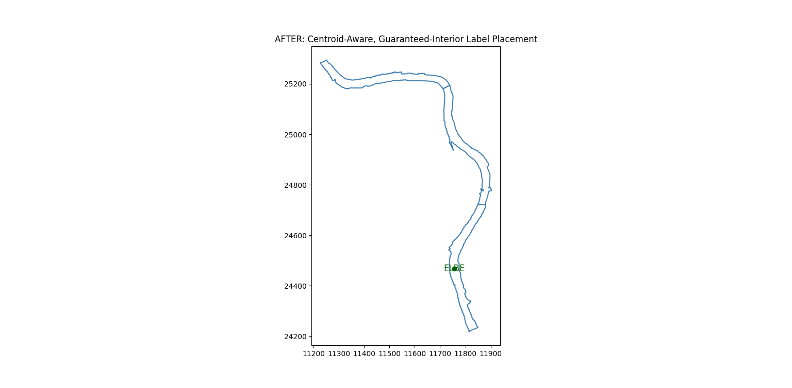
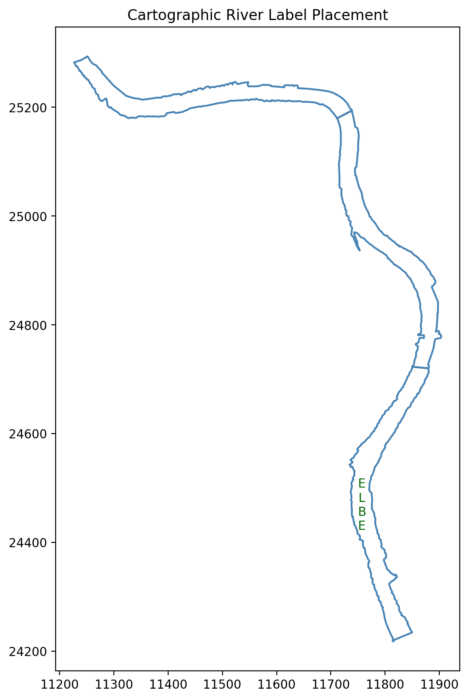

# River Label Placement – Geometry-Aware Cartographic Solution

This project solves the problem of placing a river name **inside a complex river geometry** in a cartographically correct and readable way. Simple centroid-based approaches fail on long, curved rivers; this solution is **geometry-aware and readability-first**.

---
---

## Problem Demonstration (Visual)

### Naive Centroid-Based Placement (Fails)
The centroid often lies outside the river or too close to the boundary.

---

### Intermediate Validation Attempt
Interior placement improves, but padding and readability issues remain.

---

### Final Cartographic Placement (Correct)
The label is fully inside the river, padded from edges, and optimally oriented for readability.

---
## What This Solves

- Places the river label **fully inside** the river boundary  
- Enforces **padding** so text never touches edges  
- Optimizes **readability** based on river orientation  
- Handles complex and irregular river shapes  
- Clearly flags cases where interior placement is not possible  

---

## How It Works (High Level)

1. Selects the dominant river polygon  
2. Computes a guaranteed interior anchor point  
3. Applies geometric buffering to enforce padding  
4. Estimates local river direction near the label  
5. Adapts text orientation:  
   - Horizontal rivers → horizontal text  
   - Vertical rivers → top-to-bottom stacked text  
   - Diagonal rivers → gentle rotation  
6. Validates the **rendered text bounding box**, not just the anchor point  

---

## Interactive Demo (Recommended)

A Streamlit app allows uploading any WKT river file and instantly visualizing the label placement.

**Live App:**  
https://riverlabellinggeometry-mh9tqrlcpq7s6psycsx9nb.streamlit.app/

---

## Key Strengths

- Guaranteed interior placement with padding  
- Geometry-aware, not heuristic-based  
- Readability-optimized labeling  
- Reproducible and testable via interactive demo  

---

## Tech Stack

Python · Shapely · Matplotlib · Streamlit

---

## Conclusion

This solution balances **geometric correctness, cartographic readability, and practical testability**, making it suitable for real-world map rendering workflows.

